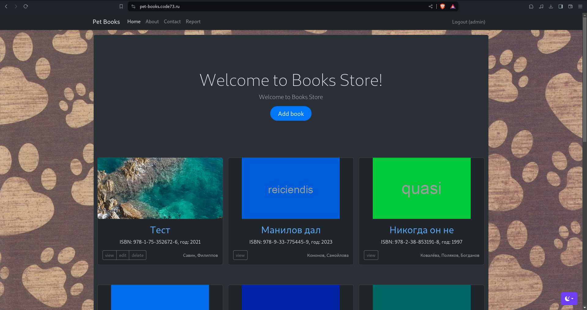

# Book Store



## Installation notes

### To run in docker:

`docker-compose up`

http://localhost:20080/

### To set up:

`./init`

`./init-roles-and-users`

### To seed demo-data:

`./init-demo-data`

### To activate profile after new user registration without email

```
php yii user/activate {login}
```

### To send SMS via SMSPilot

- Check local `.env` file and change `SMS_PILOT_API_KEY`
- Add to `/etc/cron`: `*\5 * * * * php /path/to/yii.php queue/send-notify`
